# Лабораторная работа №1: однослойный перцептрон

## Аннотация

Проект посвящён реализации однослойного перцептрона для задачи бинарной классификации с двумя числовыми признаками. Модель, обучение, функции потерь и метрики реализованы вручную на `NumPy`, без использования готовых моделей машинного обучения из `PyTorch`, `TensorFlow`, `Keras` или `sklearn.linear_model`.

В работе реализованы подготовка данных, Z-нормализация, стратифицированное разбиение, обучение mini-batch gradient descent, визуализация функции потерь и разделяющей границы, а также серия расширенных экспериментов: влияние скорости обучения, размера батча, инициализации весов, сравнение Binary Cross-Entropy и Hinge loss, L2-регуляризация, momentum, ROC-AUC, анализ ошибок, собственные генераторы данных и 5-кратная кросс-валидация.

## Структура проекта

```text
.
├── dataset.py          # генерация данных, стратифицированное разбиение, Z-нормализация
├── perceptron.py       # класс Perceptron: BCE/Hinge, L2, momentum, mini-batch обучение
├── metrics.py          # accuracy, precision, recall, F1, confusion matrix, ROC-AUC, ROC-кривая
├── visualization.py    # графики loss, граница решения, ROC-кривая, анализ ошибок
├── experiments.py      # экспериментальные запуски и сохранение результатов
├── data_generators.py  # собственные датасеты: облака, XOR, окружности, шум в метках
├── main.py             # основной запуск базовой модели
├── requirements.txt    # зависимости проекта
└── reports/            # CSV-таблицы и PNG-графики результатов
```

## Запуск проекта

```bash
python -m venv .venv
source .venv/bin/activate          # macOS / Linux
# .venv\Scripts\activate          # Windows

pip install -r requirements.txt
python main.py
python experiments.py
```

После запуска все таблицы и изображения сохраняются в папку `reports/`.

## Методология

### Подготовка данных

Базовый датасет содержит 500 объектов, 2 числовых признака и 2 класса. Данные разбиваются на обучающую и тестовую выборки в соотношении 70/30 со стратификацией, что сохраняет пропорции классов в обеих выборках.

Нормализация признаков выполняется по формуле Z-score:

```text
x_norm = (x - mean) / std
```

Параметры `mean` и `std` вычисляются только по обучающей выборке, после чего применяются к обучающей и тестовой выборкам.

### Модель

Однослойный перцептрон вычисляет линейную комбинацию признаков:

```text
z = x @ theta + bias
```

Для базовой модели используется сигмоида:

```text
p = sigmoid(z) = 1 / (1 + exp(-z))
```

Значение `p` интерпретируется как вероятность принадлежности объекта к классу `1`. Класс определяется по порогу `0.5`.

### Функция потерь

Основная функция потерь — Binary Cross-Entropy:

```text
loss = -mean(y * log(p) + (1 - y) * log(1 - p))
```

Также реализована Hinge loss для сравнения поведения модели при другой постановке оптимизации.

### Обучение

Обучение выполняется методом mini-batch gradient descent. На каждой эпохе данные перемешиваются, разбиваются на батчи, после чего для каждого батча вычисляются предсказания, ошибка, градиенты по весам и смещению. Параметры обновляются в направлении уменьшения функции потерь.

В базовом запуске используются параметры:

| Параметр | Значение |
|---|---:|
| Learning rate | 0.1 |
| Epochs | 100 |
| Batch size | 32 |

## Результаты базовой модели

| Выборка | Accuracy | Precision | Recall | F1 | ROC-AUC |
|---|---:|---:|---:|---:|---:|
| train | 0.8800 | 0.8602 | 0.9091 | 0.8840 | 0.9391 |
| test | 0.8600 | 0.8068 | 0.9467 | 0.8712 | 0.9113 |

Качество на тестовой выборке близко к качеству на обучающей выборке. Это показывает, что модель обучилась устойчиво и не демонстрирует выраженного переобучения. Высокий recall означает, что модель хорошо находит объекты положительного класса.

### График функции потерь

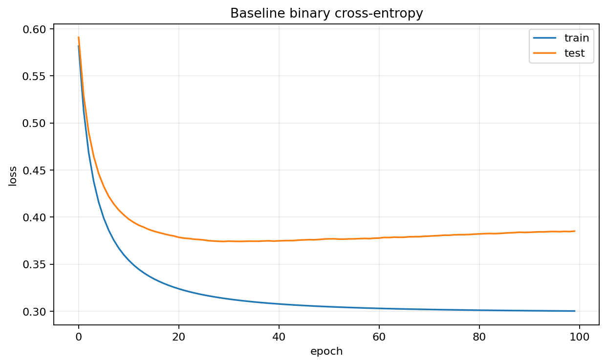

### Разделяющая граница

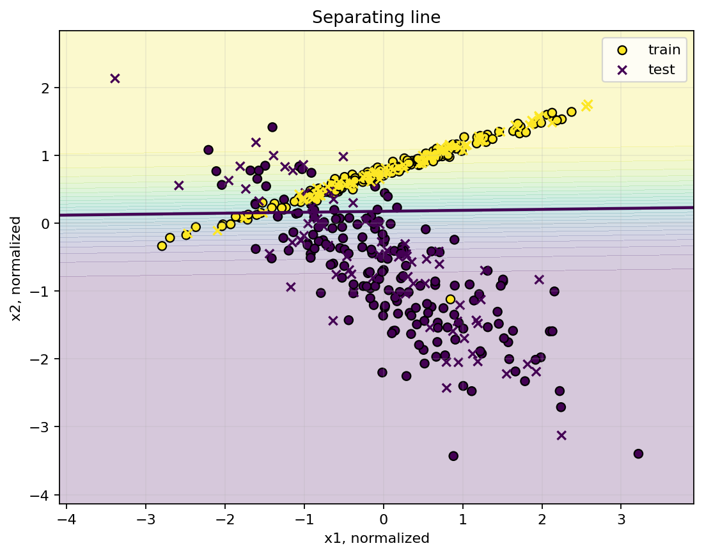

### ROC-кривая

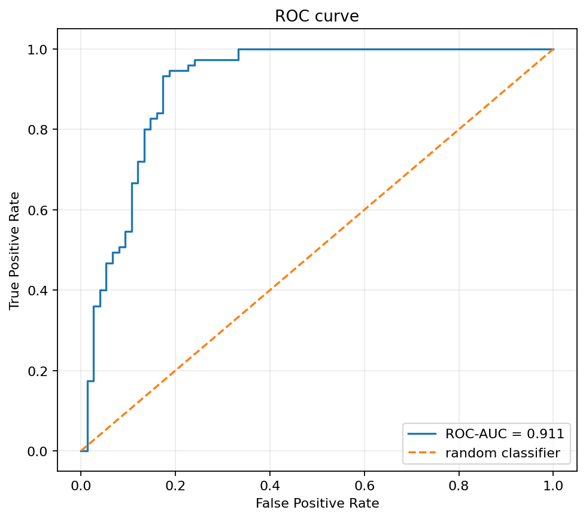

### Анализ ошибок

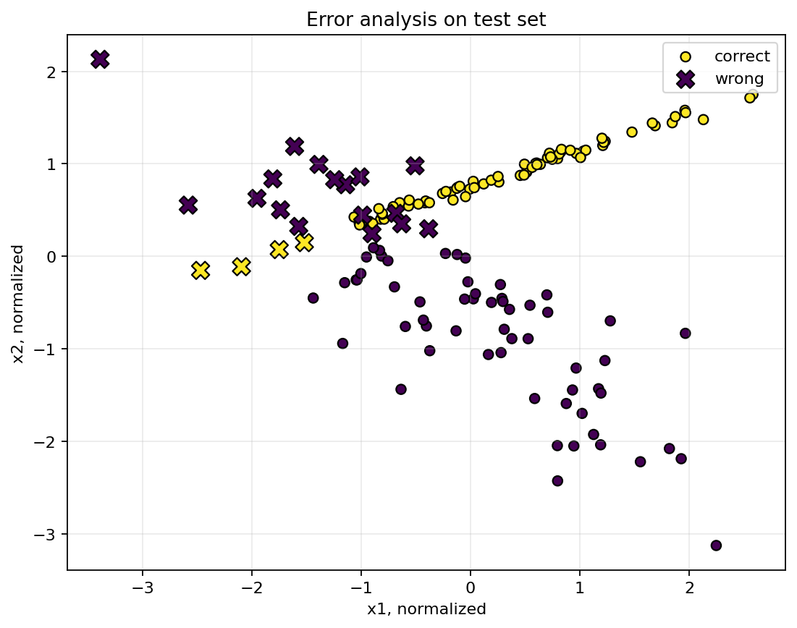

## Экспериментальная часть

### Влияние скорости обучения

Проверены значения `eta = 0.001, 0.01, 0.5, 1.0`.

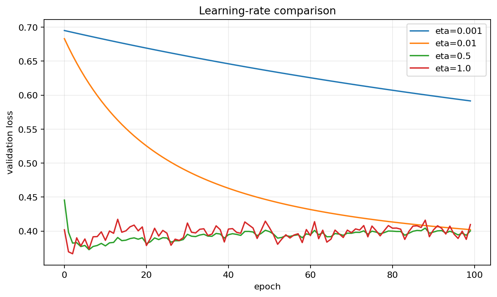

| eta | Accuracy | F1 | ROC-AUC | Итоговый val loss |
|---:|---:|---:|---:|---:|
| 0.001 | 0.8333 | 0.8538 | 0.9061 | 0.5915 |
| 0.01 | 0.8533 | 0.8675 | 0.9173 | 0.4021 |
| 0.5 | 0.8667 | 0.8780 | 0.9058 | 0.4003 |
| 1.0 | 0.8667 | 0.8780 | 0.9026 | 0.4096 |

При очень маленькой скорости обучения сходимость медленная. Более крупные значения дают более высокую итоговую accuracy, однако при большом шаге функция потерь становится менее устойчивой.

### Влияние размера батча

Проверены значения `batch_size = 1, 16, 64, 256`.

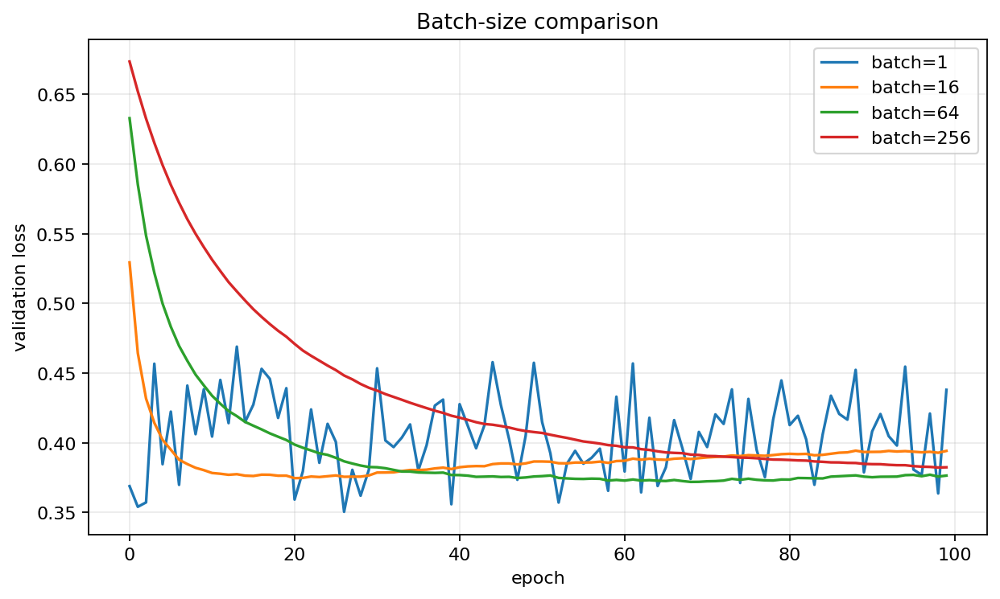

| Batch size | Accuracy | F1 | ROC-AUC | Итоговый val loss |
|---:|---:|---:|---:|---:|
| 1 | 0.8667 | 0.8795 | 0.8919 | 0.4380 |
| 16 | 0.8667 | 0.8780 | 0.9070 | 0.3942 |
| 64 | 0.8600 | 0.8712 | 0.9152 | 0.3765 |
| 256 | 0.8667 | 0.8780 | 0.9173 | 0.3824 |

Малый батч делает обучение более шумным, так как параметры обновляются после каждого отдельного объекта или небольшой группы объектов. Большие батчи дают более гладкую динамику loss, но обновляют веса реже. Средние размеры батча дают хороший баланс между скоростью и устойчивостью обучения.

### Влияние инициализации весов

Проверены варианты `zero`, `normal`, `wide_normal`.

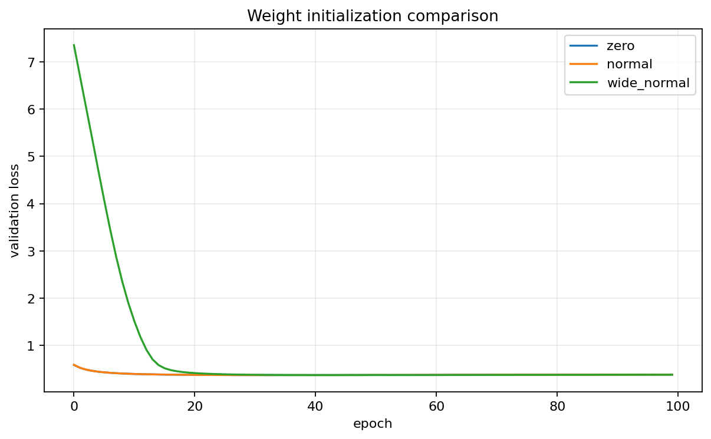

| Инициализация | Accuracy | F1 | ROC-AUC | Норма весов |
|---|---:|---:|---:|---:|
| zero | 0.8600 | 0.8712 | 0.9113 | 3.5167 |
| normal | 0.8600 | 0.8712 | 0.9113 | 3.5166 |
| wide_normal | 0.8600 | 0.8712 | 0.9129 | 3.4314 |

Для одного нейрона нулевая инициализация не приводит к проблеме симметрии, характерной для многослойных сетей с несколькими одинаковыми нейронами. Большие случайные веса потенциально могут приводить к насыщению сигмоиды, но на данном датасете модель смогла сойтись.

### Сравнение Binary Cross-Entropy и Hinge loss

В модели реализованы две функции потерь: `bce` и `hinge`.

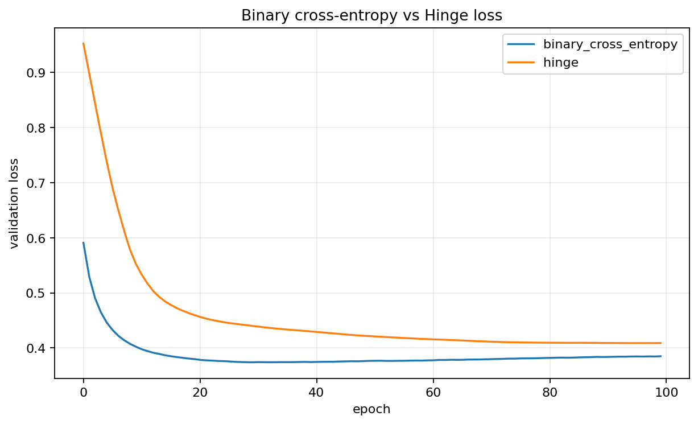

| Loss | Accuracy | Precision | Recall | F1 | ROC-AUC |
|---|---:|---:|---:|---:|---:|
| Binary Cross-Entropy | 0.8600 | 0.8068 | 0.9467 | 0.8712 | 0.9113 |
| Hinge | 0.8600 | 0.7812 | 1.0000 | 0.8772 | 0.8496 |

Binary Cross-Entropy даёт более качественную вероятностную оценку, что отражается в более высоком ROC-AUC. Hinge loss показывает высокий recall, но хуже ранжирует объекты по вероятности положительного класса.

### L2-регуляризация

Проверены значения `lambda = 0.0, 0.001, 0.01, 0.1`.

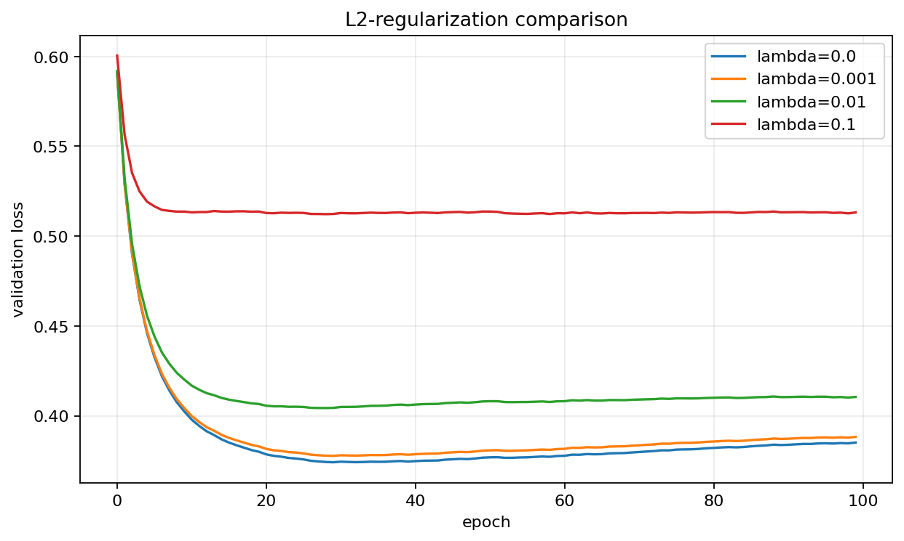

| Lambda | Accuracy | F1 | ROC-AUC | Норма весов |
|---:|---:|---:|---:|---:|
| 0.0 | 0.8600 | 0.8712 | 0.9113 | 3.5166 |
| 0.001 | 0.8600 | 0.8712 | 0.9127 | 3.3962 |
| 0.01 | 0.8667 | 0.8780 | 0.9148 | 2.6712 |
| 0.1 | 0.8533 | 0.8675 | 0.9172 | 1.2451 |

L2-регуляризация уменьшает норму весов и ограничивает сложность модели. Умеренное значение `lambda = 0.01` улучшило accuracy, а слишком сильная регуляризация снизила качество классификации.

### Momentum

Проверены значения `beta = 0.0, 0.5, 0.9, 0.99`.

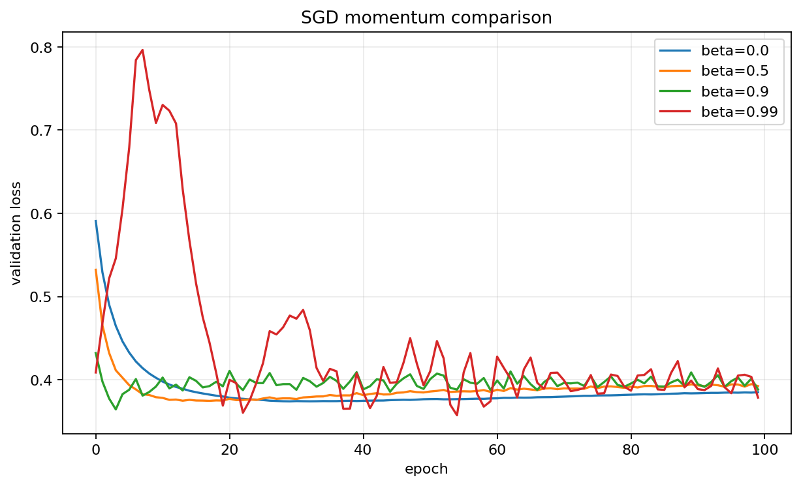

| Beta | Accuracy | F1 | ROC-AUC | Итоговый val loss |
|---:|---:|---:|---:|---:|
| 0.0 | 0.8600 | 0.8712 | 0.9113 | 0.3851 |
| 0.5 | 0.8600 | 0.8712 | 0.9077 | 0.3924 |
| 0.9 | 0.8600 | 0.8712 | 0.9095 | 0.3883 |
| 0.99 | 0.8600 | 0.8712 | 0.9120 | 0.3786 |

Momentum сглаживает направление обновления параметров. На рассматриваемом датасете итоговая accuracy почти не изменилась, но динамика функции потерь стала отличаться при разных значениях `beta`.

## Собственные генераторы данных

Реализованы три типа синтетических данных:

- `make_linear_clouds()` — два гауссовых облака;
- `make_xor()` — XOR, нелинейно разделимая задача;
- `make_circles()` — классы внутри и снаружи окружности.

| Датасет | Accuracy | Precision | Recall | F1 | ROC-AUC |
|---|---:|---:|---:|---:|---:|
| linear_clouds | 0.9933 | 0.9868 | 1.0000 | 0.9934 | 1.0000 |
| xor | 0.4200 | 0.4189 | 0.4133 | 0.4161 | 0.4171 |
| circles | 0.4667 | 0.4742 | 0.6133 | 0.5349 | 0.3904 |

Однослойный перцептрон строит линейную разделяющую границу, поэтому хорошо работает на линейно разделимых данных и плохо справляется с XOR и окружностями, где требуется нелинейная граница.

### Линейно разделимые облака

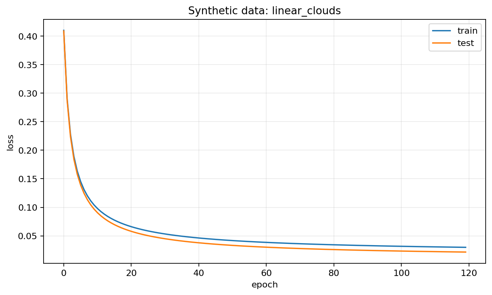

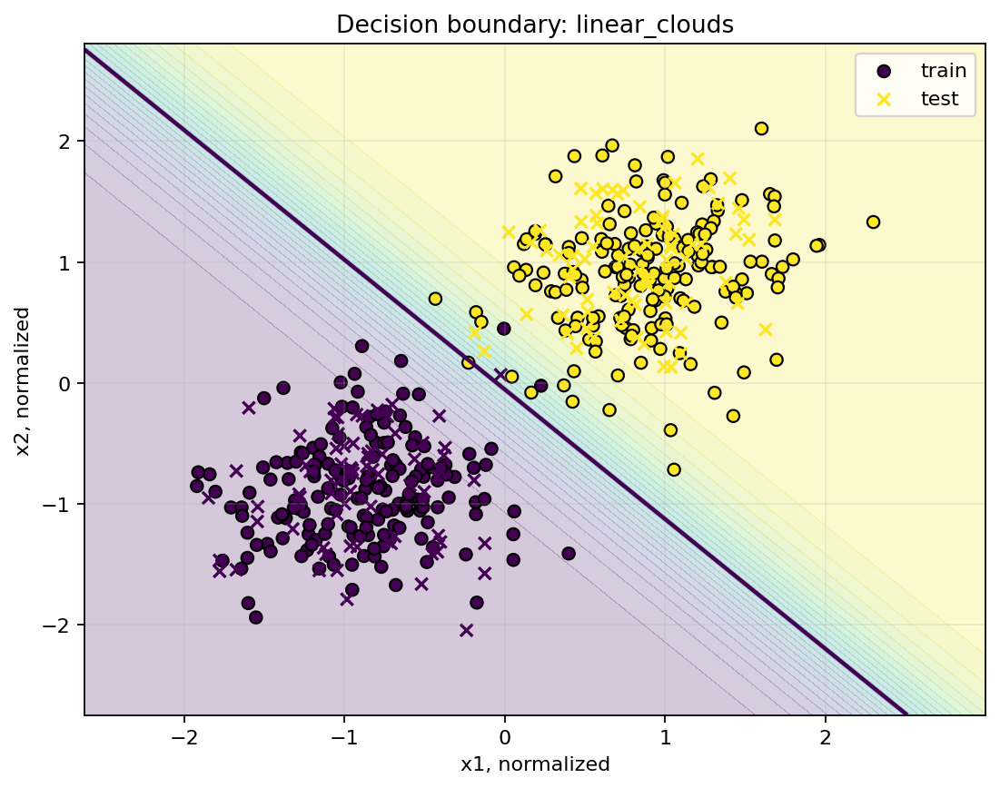

### XOR

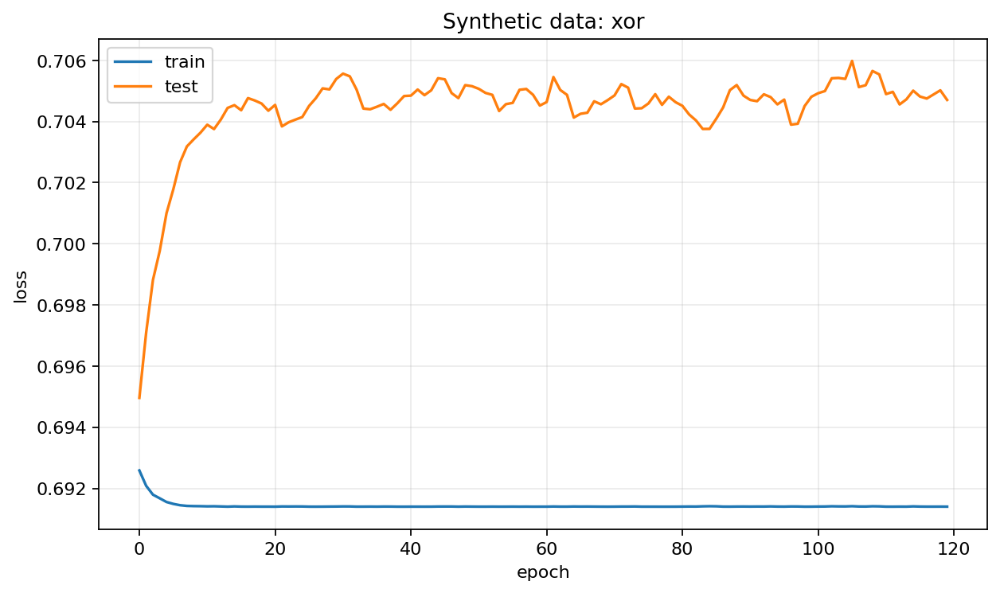

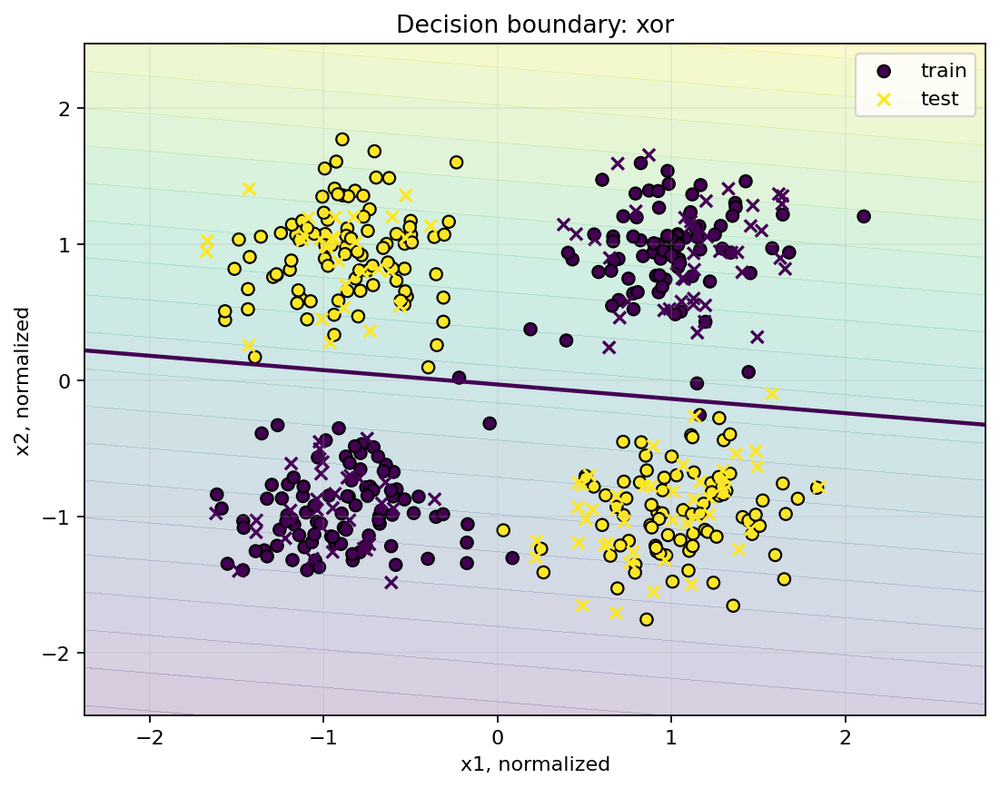

### Окружности

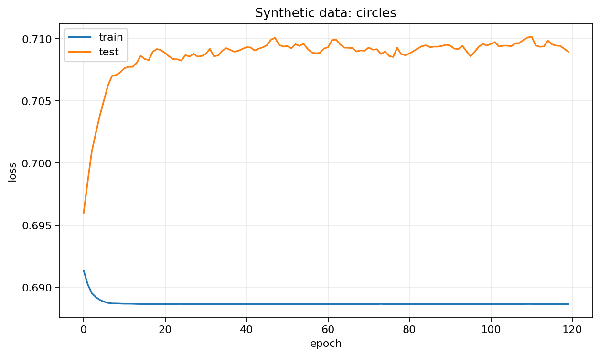

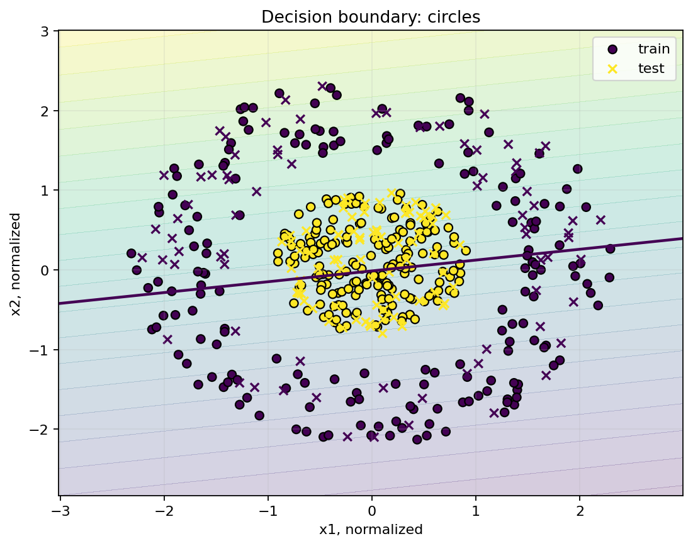

## Кросс-валидация и финальная модель

Для подбора гиперпараметров реализована 5-кратная кросс-валидация по сетке значений `learning_rate` и `batch_size`.

| Learning rate | Batch size | Mean accuracy | Std accuracy |
|---:|---:|---:|---:|
| 0.50 | 16 | 0.8855 | 0.0409 |
| 0.10 | 16 | 0.8826 | 0.0405 |
| 0.10 | 32 | 0.8826 | 0.0405 |
| 0.10 | 64 | 0.8826 | 0.0405 |
| 0.50 | 32 | 0.8826 | 0.0405 |
| 0.50 | 64 | 0.8826 | 0.0434 |
| 0.01 | 32 | 0.8771 | 0.0336 |
| 0.01 | 64 | 0.8742 | 0.0320 |
| 0.01 | 16 | 0.8684 | 0.0413 |

Лучшие параметры по средней accuracy:

| Параметр | Значение |
|---|---:|
| Learning rate | 0.5 |
| Batch size | 16 |

Финальная модель обучена с выбранными гиперпараметрами.

| Accuracy | Precision | Recall | F1 | ROC-AUC |
|---:|---:|---:|---:|---:|
| 0.8667 | 0.8090 | 0.9600 | 0.8780 | 0.9058 |

### Loss финальной модели

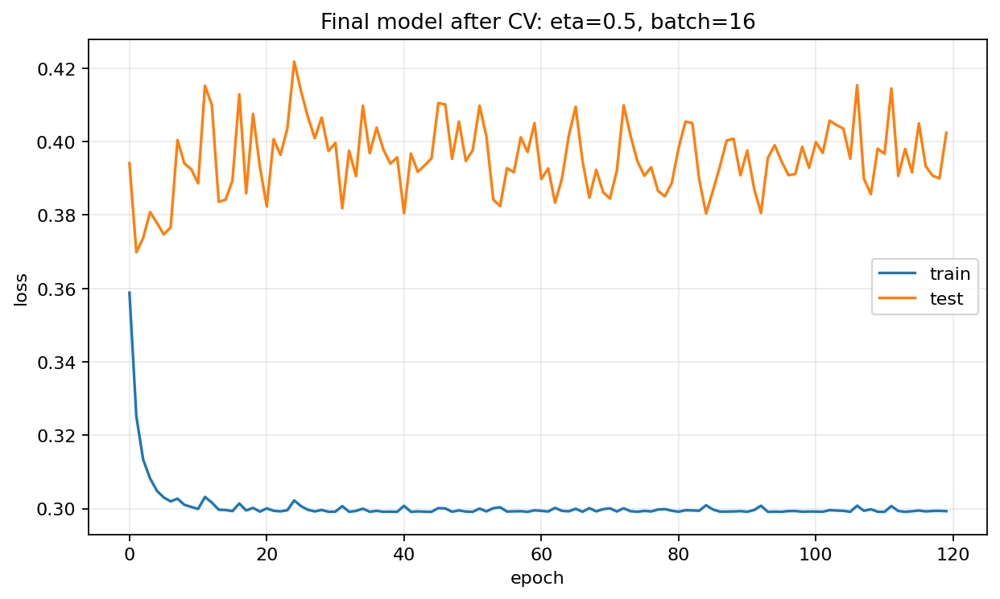

### Разделяющая граница финальной модели

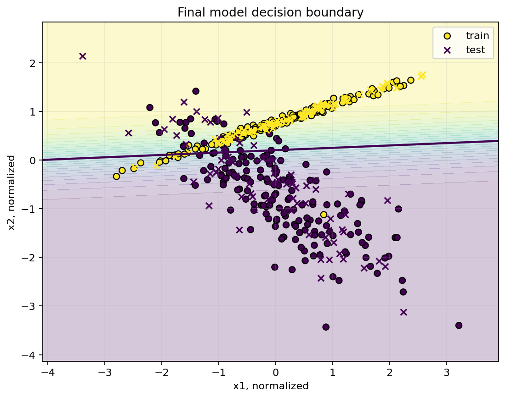

### ROC-кривая финальной модели

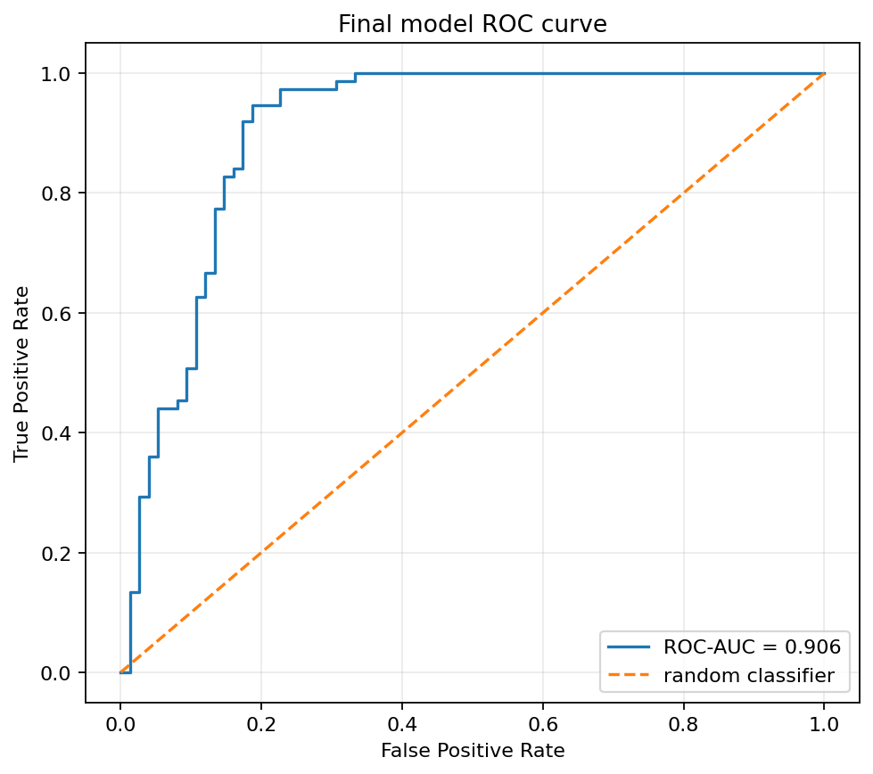

## Итоговые выводы

В проекте реализован однослойный перцептрон для бинарной классификации с полным циклом работы: подготовка данных, обучение, оценка качества, визуализация и исследование гиперпараметров.

Базовая модель показала test accuracy `0.8600` и ROC-AUC `0.9113`, что говорит о хорошем качестве линейной классификации на выбранном датасете. Подбор гиперпараметров через кросс-валидацию позволил получить финальную модель с accuracy `0.8667` и F1 `0.8780`.

Эксперименты подтвердили, что скорость обучения, размер батча, инициализация весов, регуляризация и momentum влияют на динамику сходимости и итоговое качество. На линейно разделимых синтетических данных перцептрон достигает почти идеального качества, а на XOR и окружностях качество низкое из-за линейной природы разделяющей границы.

## Зависимости

```text
numpy
matplotlib
pandas
scikit-learn
```

`scikit-learn` используется только для генерации базового датасета через `make_classification`. Модель, обучение, функции потерь и метрики реализованы вручную.
